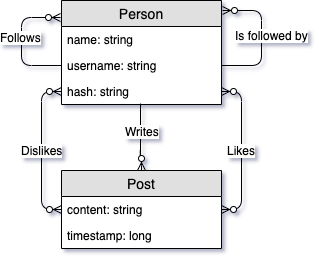
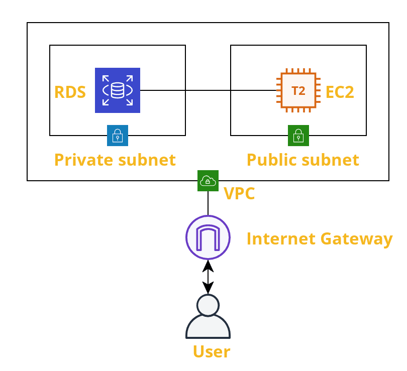
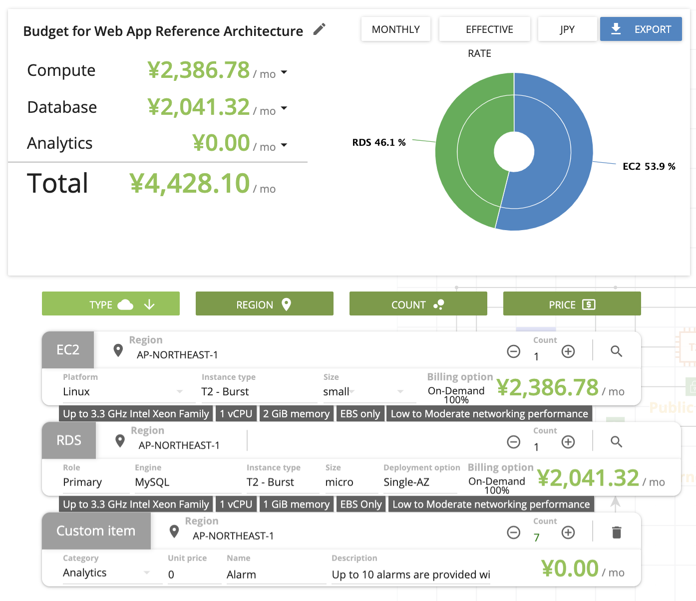

# Project Design and Architecture
This document reflects the current architecture of the system.

## Overview

- Language: Java
- Architecture: MVC, Repository pattern, Server side rendering
- Framework: Play
- Database: MYSQL
- Infrastructure: AWS (EC2 + RDS)

# Implementation

## Front end
- The front end is rendered by the back end using the Twirl templating language that comes with the play framework.
- IntelliJ has trouble type checking the aspects of twirl that are scala specific.
- Simple validation (e.g password min lengths etc) are handled automatically by Twirl by making use of the @Constraints annotation provided by play.
- More complex validation, (e.g username is taken) is done manually.
- A single 17 line JS file (main.js) is used to append the emoji picker button to the DOM.
- Javascript libraries
    - The JS libraries used are: bootstrap, emojiButton, jquery and popper.js (also needed by bootstrap)
- Styling
    - Styling is done using bootstrap v4

## Backend

- JPA
    The backend uses the Java Persistence API for handling access to the database.
    - Hibernate 
        - Hibernate is the choice for the persistence library because of its prevelence and maturity.

    
    This diagram shows the logical relationship between the two main entities, Person and Post.
- Configuration
    - Development:
        - DB: 
            - For testing purposes an H2 in memory database in MYSQL mode is used.
        - Logging: 
            - Info messages for starting up/shutting down.
            - All request are logged with headers, body and session.
            - All SQL queries are logged with parameters.
    - Production:
        - DB: 
            - The RDS instance is used.
        - Logging: 
            - Info messages for starting up/shutting down.
            - Only requests that cause HTTP status 500 errors are logged with headers, body and session.
    - Testing:
        - This configuration is for running the e2e cypress tests.
        - DB: 
            - A MYSQL running on localhost with username="username" and password="password" with a database called testDB is used.

## Testing

- Backend
    - The backend is tested using Junit tests for each model, repository and controller.
- Frontend
    - Cypress is used for end to end tests that test the front end as well as the back end. Cypress is configured to test a server running on port 5555. Cypress advocates seeding the server with data to set up each test, this unfortunately fails due to the CSRF filter that Play provides by default. Turning of this filter means that the server code no longer compiles due to the use of "@helper.CSRF.formField" in the Play Templates as part of the view.
    

## Infrastructure

- AWS Instance : 1 x EC2 t2.small 
- WebServer: NGINX 
- Database server: 1 x RDS db.t2.micro 

The infrastructure consists of an EC2 instance running NGINX and a an RDS instance running MYSQL.

- EC2 T2 Small 
    - Nginx
    - WebServer

- RDS T2 Micro
    - MYSQL ver 5.7.22-log 

- Amazon cloud watch

- Alarms
   - All alarm triggers are eveluated using an average over a period of 5 minutes.
        - EC2 Alarms
            - CPU usage >= 80% (this may indicate a need for load balancing)
            - Network packets in >= 1 billion (DoS attacks cause a spike of network packets)
            - Network on average >= 1GB (this may indicate a need for load balancing)
        - RDS Alarms
            - Failed SQL Statements >= 1 (There should not be any failed SQL statements)
            - Failed logins >= 3 (2 failed attempts are allowed for administrators fingers slipping when logging in, otherwise it may indicate anauthorised access to the database)
            - Free storage space <= 5.24G (May indicate a need for load balancing/aditional space)
            - CPU utilization >= 80% (May indicate a need for load balancing)

- Budget
    - Under full load the cost of operating the system is projected to be ¥4428.10 per month

