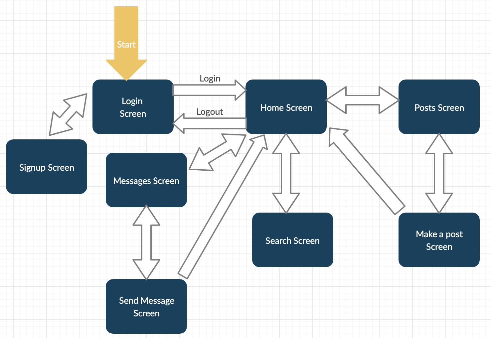
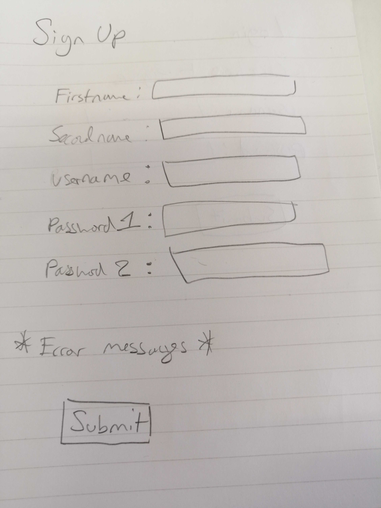
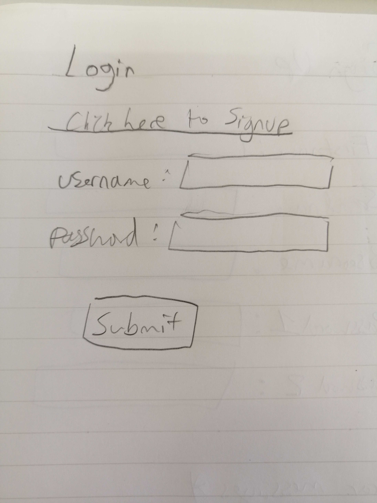
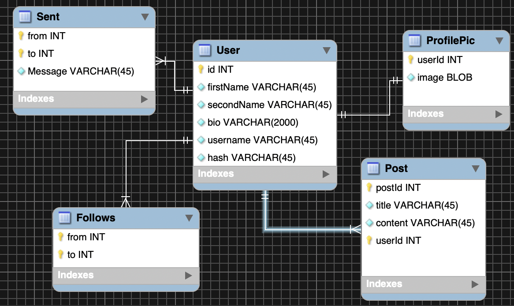

# Final Project

## Disclaimer

This document is to serve only as an initial plan, modifications may be made at any time without notice.

## The Service

- This service will be a messaging platform with the unique selling point being that all messages must consist solely of emojis.
- Restricting the type of the communication that is possible has proven to be popular for other social networks (Snapchat: only images/limited view count, Instagram: primarily images, Twitter: 280 character limit, Youtube: Videos only)
- Competing with Facebook by offering a service that is too similar means that there is a high chance that a new service will fail to attract users.
- Limiting expression solely to emojis is a novel way to foster interest from the users who may already be content with mature services such as Facebook but are willing to experiment with a new service that offers an alternative experience.
- 絵文字メッセンジャーサービス。全てのメッセージは絵文字以外は不可能です。
- 現在でももっともユーザーが多いSNS、フェイスブックは、投稿、画像、動画、メッセージなど、いろんなコミュニケーションの機能を提供してるサービスです。最近の人気になったSNSは、フェイスブックと同じ幅が広いサービスではなく、スナップチャット、インスタグラムみたいな機能が限られてるサービスです。

## Target Audience

Since this SNS is not specific to a certain domain (e.g. sports), the target audience is anyone within the 13~25 age range. Because it is an emoji based social network it is not aimed at users looking for practicality (LinkedIn etc.), rather it is aimed at users looking for an interesting novel experience and younger users tend to be more open to this. Users would have to communicate using sentences such as [these](https://blazepress.com/2014/10/21-emoji-combinations-use-words-wont-quite-cut/).

## Technologies

The libraries, frameworks and tools that will be used.

### Architecture

The application will follow the immensely popular [model view controller pattern (MCV)](https://ja.wikipedia.org/wiki/Model_View_Controller).

### Backend

- Play framework - (Faster development cycle vs Spring Boot thanks to hot reloading, better error messages)
- H2 DBMS - (Local environment only, good for development since it operates within memory - can be set to emulate MYSQL syntax)
- Hibernate (ORM handles the automatic (de)serialization of objects retrieved and stored within the database)
- Junit - (Its the industry standard for testing)
- HikariCP - (Thread pool manager)

### Frontend
I will be using Play's template engine.

## Application Flow

## Functionality

### Sign Up

1. The user enters their details, all details apart from the password are sent to the server.
2. The server will calculate a secure hash of the password and save it along with the other details, in the database.

### Login

1. The user enters their username and password, these are sent to the server.
2. The server calculates the hash of the password and checks it matches that of the database.
3. If they match then the login is successful.
4. Otherwise the user is asked again for the password.

### Home

From this screen the user can access the functionality of the application.

### Logout

1. A simple button that once pressed will make a request to the server.
2. On reception of this request the server will invalidate the user's session cookies.

### Write a post

1. An emoji picker appears on the screen which the user can use to type their post. The input box will not allow any characters that are not emojis.
2. When the submit button is pressed the post is sent to the server which writes it to the database.

### View posts

1. All posts made by followed users are displayed in chronological order.

### Messages

1. Shows a list of conversations with followed users.

### Send Message

1. The User can type a message using the emoji picker.
3. The User presses the send button.
2. When sent, the message is written to the database, it is also emitted as a Server Sent Event (SSE) to the recipient's browser.

### Search

1. The user can type the username of the person they are looking for into the search box.

2. As the user types names, usernames that partially match are displayed in a drop-down box.

3. To the right of the selected user will be a button that says "Follow".

### Follow User

1. The user can click the "Follow" button after searching.
2. This will add the selected user to the followed list.

## DB Schema

### Encoding

utf8mb4 will be used as the character encoding because it allows 4 bytes per character. This allows for emojis/special characters to be safely stored in the database.

If posts consist only of emojis there may not be a need for a title, however I have included it in the DB schema in case I was not able to implement an emoji picker. In this case the system can still be used as a standard SNS.

## Infrastructure

- WebServer: NGINX (it is the industry standard and the one I have most experience with).
- AWS Instance : 1 x EC2 t2.small - Within budget and suitable for web deployment.
- Database server: 1 x RDS db.t2.micro - One of the few RDS DB instances that is within budget.

- Amazon cloud watch
   - EC2 Alarms
      - CPU usage (Abnormal CPU usage would indicate problems)
      - Network packets on average (DoS attacks cause a spike of network packets, sometimes accompanied by abnormally low CPU usage)
      - Network on average (To identify times of high user load)
   - RDS Alarms
     - Failed SQL Statements (A spike could indicate an SQLi attack)
     - Failed logins (A spike could indicate a password cracking attempt)
     - Freeable memory (To indicate high user load)
     - CPU utilization (To indicate high user load) 
     - Free Storage Space Average (To indicate that the storage needs to be expanded)

## Security

The top 3 web application attacks are (In order of frequency):

1. SQL injection - I will be using Hibernate instead of writing SQL manually.
2. XSS - I will be escaping user input in the front end.
3. DoS - The AWS budget we are allocated is not adequate to build redundancy into the infrastructure so the application will be vulnerable to DoS attacks.

- Cross-Site Request Forgery will be prevented by using Play's built in authenticity tokens.

- To prevent password cracking I will be storing secure hashes instead of plaintext passwords. 

## Logging

- The application will log all requests and responses with identifiers, this is in order to triage errors.

- For example if a record was not inserted into the database correctly, the identifier provided by the log could be used to manually expect the database and rectify the failed insertion.

## Monitoring

- AWS cloudwatch will be used for monitoring, alarms will dispatch notifications in response to dangerous indicators as mentioned [above](#infrastructure).

## Testing

The tests are to be written using the TDD methodology:

1. Failing test that captures a unit of functionality is written.
2. The functionality is implemented causing the test to pass.
3. Refactoring is done as necessary.
4. Go to 1.

### Unit tests

- Unit tests for each function within the models and repositories.
- Unit tests for each endpoint - check that the correct response it returned.
- Unit tests for each template - check that the templates are rendered correctly.

### End to end tests

- Simple tests that check basic operability with the server running. (e.g. if you go to /login make sure there is a login form)

## Deliverables

The finished product.

### Basic 

These requirements must be completed as part of the basic specification for the product.

1. To implement basic sign up, login/logout functionality.
2. To implement the ability for a user to make a post.
3. To implement a functionality that allows search by username.

The implementation should be robust (not flaky), secure (security best practices are followed) and well documented.

### Advanced

These requirements are to be implemented if and when the basic requirements have been successfully implemented.

1. Use of Javascript on the front end, dynamic forms/react
2. Implementation of the original emoji chat feature.
3. Implementation of followers/following.

## Development Schedule

Please see the schedule [here](<https://docs.google.com/spreadsheets/d/10fHqSS7Z_7x_NnHbh4RawJC6IhHzGL5-zr4lxS9T_Xg/edit?usp=sharing>).

<!-- Why title? -->
<!-- Why will you log certain things? -->
<!-- How much will cloudwatch cost? -->
<!-- Write that H2 database is for local environment. -->
<!-- Explain why you chose that age range. -->
<!-- What will the users do? How would they use it? -->

Check what kind of search I can do?

